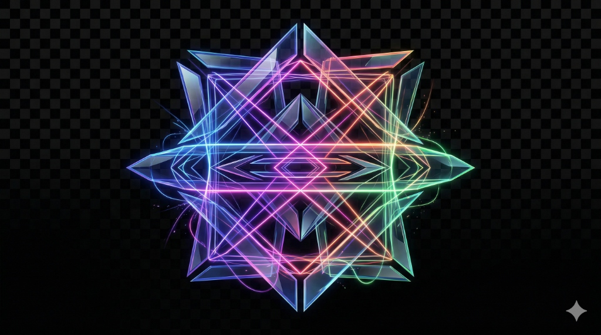

# 🔍 The Weaver's Glass


**The Weaver's Glass** is a powerful Manifest V3 Chrome Extension and FastAPI backend suite that allows developers to precisely extract, clone, and map UI elements from any modern webpage.

Armed with a specialized Deep DOM Extraction Engine, it instantly captures visual components and seamlessly translates them into reusable raw HTML, CSS, React components, and Tailwind 3 JIT utility classes.

## ✨ Features

- **Deep CSS DOM Extraction**: Recursively traverses nested child elements and filters 60+ critical layout properties to guarantee a 1:1 visually perfect replication.
- **Precision Targeting**: Seamlessly navigate nested HTML container trees using `ArrowUp` and `ArrowDown` keyboard shortcuts with an active visual breadcrumb HUD.
- **React & Tailwind Compilers**: Instantly copy your captured element as a perfectly formatted React functional component, or inject extracted styles directly into tags using a heuristic Tailwind CSS JIT mapper. 
- **1-Click CodePen Exporting**: A lightweight API bridge that wraps your captured component and dynamically POSTs it to a fresh CodePen sandbox in a single click.
- **Visual Local Storage**: Persists high-fidelity screenshot thumbnails alongside your UI code using Chrome's native Canvas API combined with an asynchronous local SQLite database.

---

## 🌍 Platform Compatibility
**The Weaver's Glass** is completely cross-platform! 
- **The Extension** runs natively on Windows, macOS, and Linux within Google Chrome or any Chromium-based browser (Brave, Edge).
- **The Backend API** is built in OS-agnostic Python and works flawlessly across all operating systems.

---

## 🚀 Installation & Usage

### 1. The Sanctuary (Backend API)
The backend is built with Python 3, FastAPI, and SQLAlchemy. It listens on port 8000.

1. Open your terminal at the root of the project and navigate into the `backend/` folder:
   ```bash
   cd backend
   ```
2. **(Crucial for Mac/Linux)** Create and activate a Python virtual environment to prevent module path errors:
   - **Mac/Linux:**
     ```bash
     python3 -m venv venv
     source venv/bin/activate
     ```
   - **Windows:**
     ```bash
     python -m venv venv
     venv\Scripts\activate
     ```
3. Install the lightweight dependencies into your environment: 
   ```bash
   pip install -r requirements.txt
   ```
4. Start the server (it will automatically generate your local database):
   ```bash
   python -m uvicorn main:app --port 8000
   ```
   *(Mac/Linux users may need to use `python3` instead of `python`)*

### 2. The Lens (Chrome Extension)
1. Open Google Chrome and navigate to `chrome://extensions/`.
2. Toggle **Developer mode** to ON in the top right corner.
3. Click **Load unpacked** and select the `extension/` folder inside this repository.
4. Pin "The Weaver's Glass" to your Chrome toolbar for easy access.

### 3. Start Weaving!
1. Start the FastAPI server.
2. Navigate to your favorite styled webpage.
3. Click the extension icon and hit the **Capture Mode** button (or press `Ctrl+Shift+U` on Windows / `Cmd+Shift+U` on macOS).
4. Hover your mouse over any beautiful UI element to highlight it in glassmorphic neon.
5. *(Optional)* Use your Up and Down keyboard arrow keys to precisely adjust the depth of the selection container!
6. Click to flawlessly extract the component.
7. Open your gallery to view, copy React/Tailwind code, or ship it directly to CodePen!

---

## 📜 License
This project is licensed under the Apache License 2.0. See the `LICENSE` file for more details.
